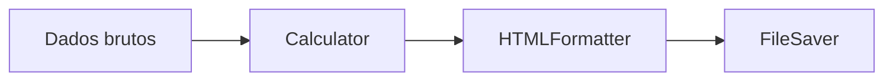
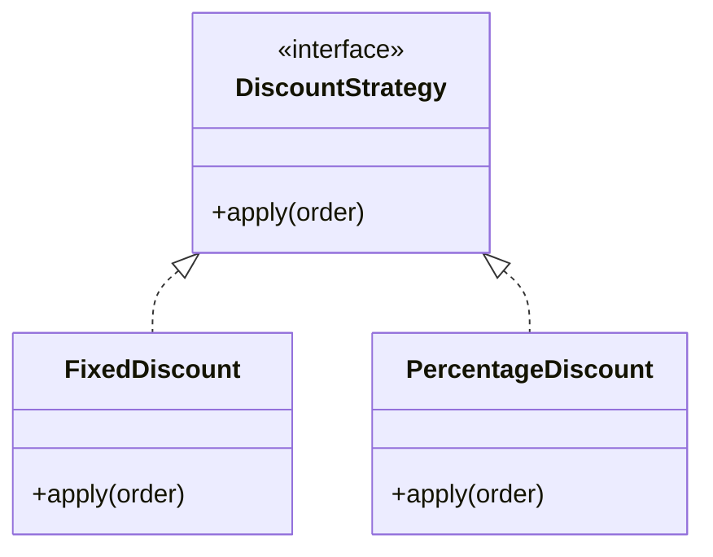
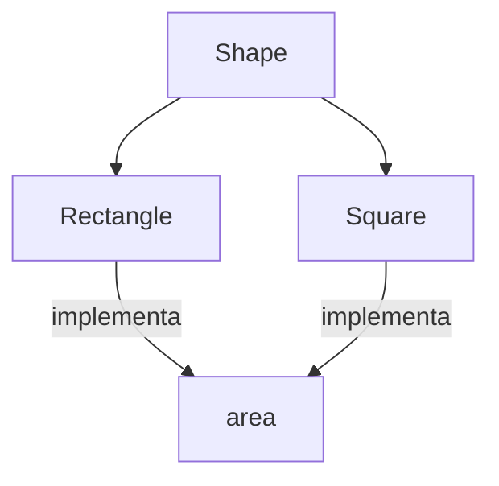
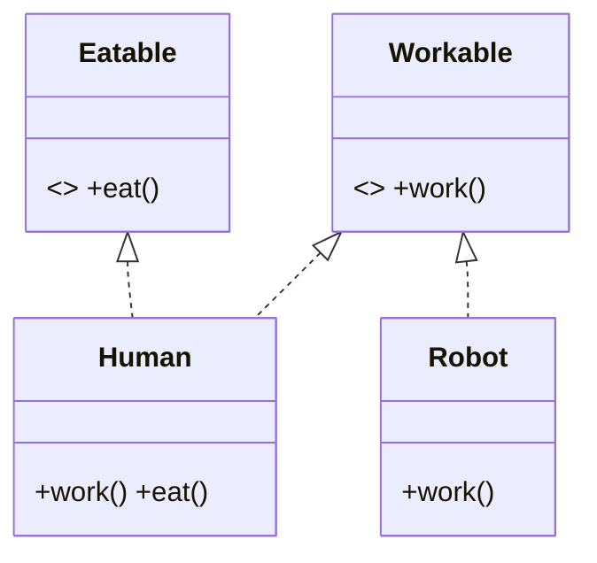
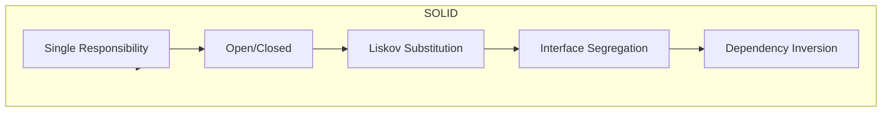
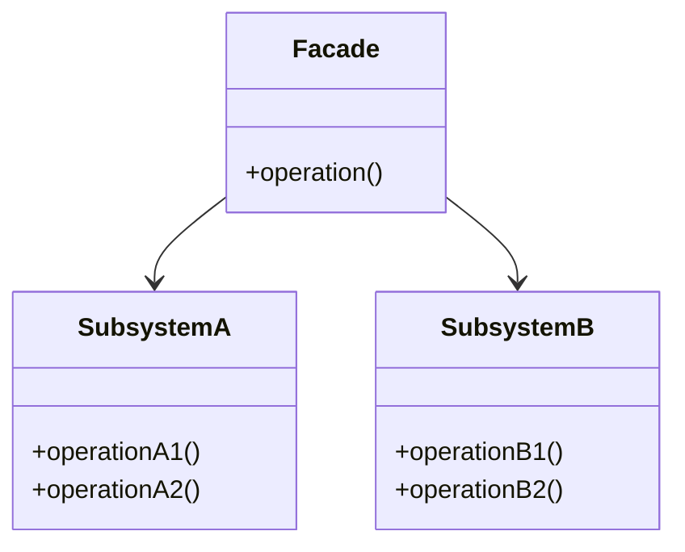
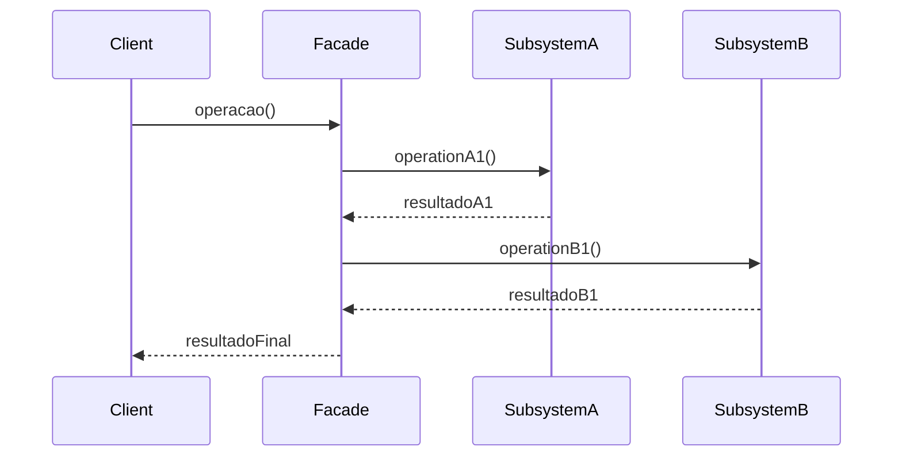

**Princípios SOLID em OOP**
Os princípios SOLID são cinco diretrizes para tornar código orientado a objetos mais **manutenível**, **extensível** e **testável**. Veja abaixo cada princípio com definição, diagrama Mermaid e exemplos em Python.

---

## 🔶 1. Single Responsibility Principle (SRP)

> “Uma classe deve ter apenas uma razão para mudar.”

* **Responsabilidade única**: cada classe faz apenas uma coisa e faz bem feito.

```python
# ❌ Violação: classe faz várias coisas
class ReportManager:
    def __init__(self, data):
        self.data = data

    def calculate(self):
        # Lógica de cálculo
        return sum(self.data)

    def format_html(self, result):
        return f"<h1>Resultado: {result}</h1>"

    def save_to_file(self, html, filename):
        with open(filename, "w") as f:
            f.write(html)

# ✅ Correto: separa cálculo, formatação e persistência
class Calculator:
    def calculate(self, data):
        return sum(data)

class HTMLFormatter:
    def format(self, result):
        return f"<h1>Resultado: {result}</h1>"

class FileSaver:
    def save(self, content, filename):
        with open(filename, "w") as f:
            f.write(content)

# Uso
data = [1, 2, 3]
result = Calculator().calculate(data)
html   = HTMLFormatter().format(result)
FileSaver().save(html, "report.html")
```



---

## 🔶 2. Open/Closed Principle (OCP)

> “Entidades de software devem estar abertas para extensão, mas fechadas para modificação.”

* **Aberto para extensão**: adicionamos comportamento novo sem alterar código existente.
* **Fechado para modificação**: código original não é tocado.

```python
from abc import ABC, abstractmethod

# ❌ Violação: cada vez que precisamos de novo tipo, mexemos aqui
class DiscountCalculator:
    def calculate(self, order, discount_type):
        if discount_type == "fixed":
            return order.total - 10
        elif discount_type == "percentage":
            return order.total * 0.9

# ✅ Correto: estende novos descontos por subclasses
class DiscountStrategy(ABC):
    @abstractmethod
    def apply(self, order):
        pass

class FixedDiscount(DiscountStrategy):
    def apply(self, order):
        return order.total - 10

class PercentageDiscount(DiscountStrategy):
    def apply(self, order):
        return order.total * 0.9

def calculate_price(order, strategy: DiscountStrategy):
    return strategy.apply(order)
```



---

## 🔶 3. Liskov Substitution Principle (LSP)

> “Objetos de uma classe derivada devem poder substituir objetos da classe base sem quebrar a aplicação.”

* **Substituibilidade**: qualquer instância de subtipo funciona como o supertipo sem comportamentos inesperados.

```python
# ❌ Violação: Retângulo e Quadrado – quadrado quebra expectativas
class Rectangle:
    def __init__(self, w, h):
        self.width = w
        self.height = h
    def area(self):
        return self.width * self.height

class Square(Rectangle):
    def __init__(self, side):
        super().__init__(side, side)

def resize(rect: Rectangle, w, h):
    rect.width = w
    rect.height = h
    assert rect.area() == w * h  # Falha se rect for Square

# ✅ Correto: modela quadrado sem herdar de retângulo
class Shape(ABC):
    @abstractmethod
    def area(self):
        pass

class Rectangle(Shape):
    # idem acima
    ...

class Square(Shape):
    def __init__(self, side):
        self.side = side
    def area(self):
        return self.side * self.side
```



---

## 🔶 4. Interface Segregation Principle (ISP)

> “Muitas interfaces específicas são melhores que uma única interface geral.”

* **Cohesão de interfaces**: clientes não devem ser forçados a depender de métodos que não usam.

```python
# ❌ Violação: interface inchada
class Worker(ABC):
    @abstractmethod
    def work(self): pass
    @abstractmethod
    def eat(self): pass

class Robot(Worker):
    def work(self): ...
    def eat(self):  # não faz sentido para robô!
        raise NotImplementedError

# ✅ Correto: separa interfaces
class Workable(ABC):
    @abstractmethod
    def work(self): pass

class Eatable(ABC):
    @abstractmethod
    def eat(self): pass

class Human(Workable, Eatable):
    def work(self): ...
    def eat(self): ...

class Robot(Workable):
    def work(self): ...
```



---

## 🔶 5. Dependency Inversion Principle (DIP)

> “Módulos de alto nível não devem depender de módulos de baixo nível. Ambos devem depender de abstrações.”

* **Abstração**: camadas superiores usam interfaces, não implementações concretas.
* **Inversão**: quem escolhe a implementação é injetado de fora (Dependency Injection).

```python
# ❌ Violação: módulo de alto nível depende do concreto
class MySQLDatabase:
    def connect(self): ...

class UserRepository:
    def __init__(self):
        self.db = MySQLDatabase()
    def get_user(self, id): ...

# ✅ Correto: depende da abstração
class Database(ABC):
    @abstractmethod
    def connect(self): pass

class MySQLDatabase(Database):
    def connect(self): ...

class UserRepository:
    def __init__(self, db: Database):
        self.db = db
    def get_user(self, id): ...

# Injeção de dependência
db = MySQLDatabase()
repo = UserRepository(db)
```

```mermaid
flowchart LR
    Database[<<interface>> Database]
    MySQLDB[MySQLDatabase]
    Repo[UserRepository]
    Database <|.. MySQLDB
    Repo -->|depends on| Database
```

---

### 🌟 Visão Geral SOLID



> Seguir SOLID ajuda a manter seu código **limpo**, **modular** e **fácil de testar**. Ferramentas como **pytest**, **mypy** e **Black** complementam a adoção desses princípios.

---

**Referências para se aprofundar:**

* *Clean Architecture*, Robert C. Martin
* *Agile Principles, Patterns, and Practices in C#*, Robert C. Martin
* Documentação oficial Python sobre `abc` (Abstract Base Classes)


Aqui está uma visão completa do **Padrão Facade** em OOP, com definição, diagramas Mermaid e exemplos em Python.

---

## 🔶 Definição

O **Facade** (ou Fachada) é um padrão estrutural que fornece uma interface unificada e simplificada para um conjunto de interfaces de um subsistema complexo.

* **Objetivo**: esconder a complexidade dos componentes internos, expondo apenas os serviços de alto nível que o cliente precisa.
* **Benefícios**:

  * Reduz o acoplamento entre clientes e subsistemas internos.
  * Facilita o uso e entendimento da API.
  * Permite evolução interna sem impactar clientes.

---

## 🔶 Diagrama de Classes (UML)



---

## 🔶 Diagrama de Sequência



---

## 🔶 Exemplo em Python

```python
# —— Subsystems —— #
class SubsystemA:
    def operationA1(self):
        return "A1 feito"

    def operationA2(self):
        return "A2 feito"

class SubsystemB:
    def operationB1(self):
        return "B1 feito"

    def operationB2(self):
        return "B2 feito"


# —— Fachada —— #
class Facade:
    def __init__(self):
        self._subsysA = SubsystemA()
        self._subsysB = SubsystemB()

    def operation(self):
        # Orquestra chamadas aos subsistemas
        result = []
        result.append(self._subsysA.operationA1())
        result.append(self._subsysA.operationA2())
        result.append(self._subsysB.operationB1())
        result.append(self._subsysB.operationB2())
        return " | ".join(result)


# —— Cliente —— #
if __name__ == "__main__":
    facade = Facade()
    print("Chamando fachada:")
    print(facade.operation())
    # Saída:
    # Chamando fachada:
    # A1 feito | A2 feito | B1 feito | B2 feito
```

---

### 🌟 Quando usar

* Quando há um conjunto de classes complexas com dependências difíceis de entender.
* Para fornecer uma API de alto nível, ocultando detalhes de implementação.
* Para facilitar testes: basta mockar a fachada em vez de todos os subsistemas.

---

**Resumo**: o Facade melhora a legibilidade e o desacoplamento, fornecendo um ponto único de entrada para operações comuns em subsistemas ricos e interconectados.
